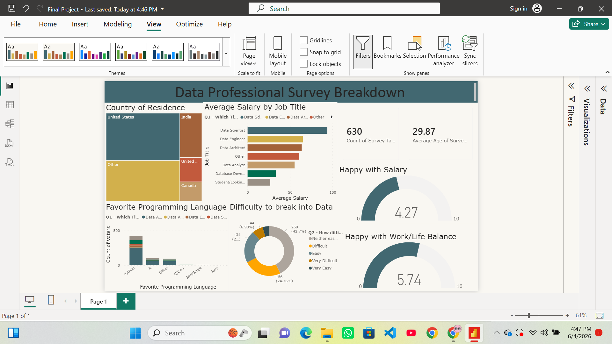

# Data Professional Survey Breakdown (Power BI)

An interactive Power BI dashboard analyzing survey responses from data professionals — covering job titles, salaries, job satisfaction, programming language preferences, and how difficult people found breaking into the data field.

  

## 📊 Project Overview
This project explores a public survey dataset of data professionals to understand patterns in compensation, career satisfaction, and tooling preferences across the field.

## 🎯 Dashboard Visualizations
- **Country of Residence** — breakdown of survey respondents by country (United States and India top the list)
- **Average Salary by Job Title** — compares average salary across roles including Data Scientist, Data Engineer, Data Architect, and Data Analyst
- **Favorite Programming Language** — distribution of preferred languages among respondents
- **Difficulty to Break into Data** — donut chart showing how respondents rated their entry into the field (Easy, Difficult, Very Difficult, Very Easy, Neither)
- **Happy with Salary / Happy with Work-Life Balance** — gauge visuals scoring overall satisfaction (out of 10)

## 💡 Key Findings
- Out of 630 survey respondents (average age ~29.9), Data Scientist was both the most common job title and the highest-paying role on average
- Job satisfaction skewed low — respondents rated salary satisfaction at 4.27/10, while work-life balance scored somewhat higher at 5.74/10
- Python was by far the most popular programming language among respondents, well ahead of R, Java, and JavaScript
- The largest single group (42.7%) rated breaking into the data field as neither easy nor difficult, suggesting entry experiences are mixed rather than uniformly hard

## 🛠️ Tools Used
- Power BI — data modeling, DAX measures, interactive visuals

## 🔗 Files
- `.pbix` file — full Power BI report
- Dataset used for the survey analysis
